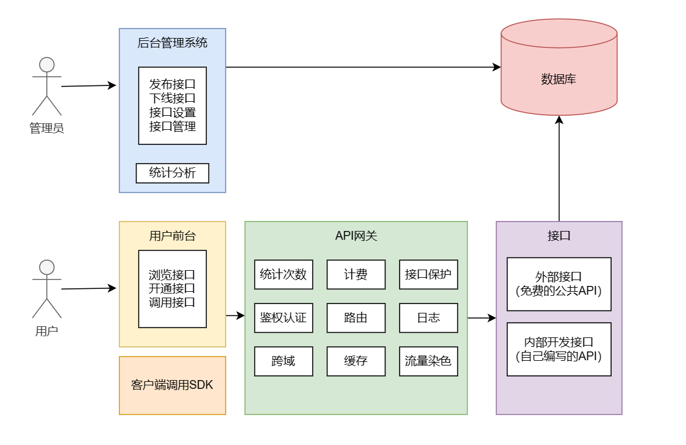
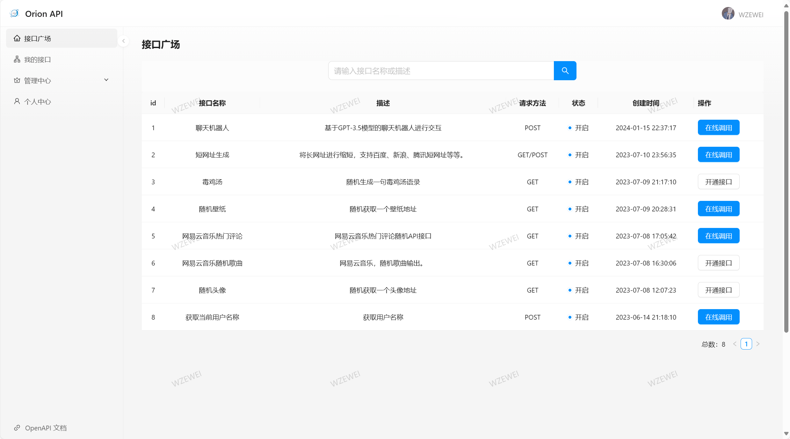
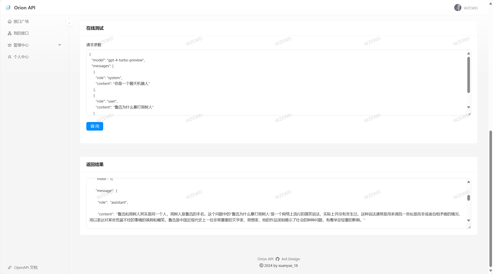
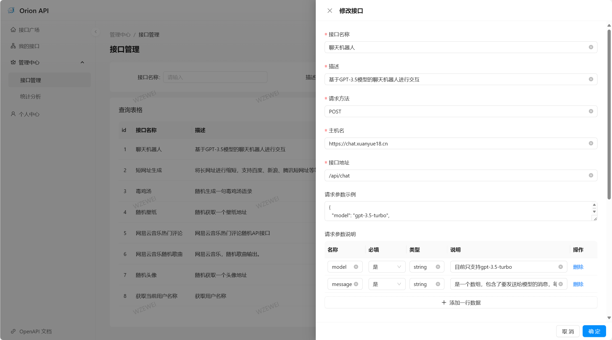
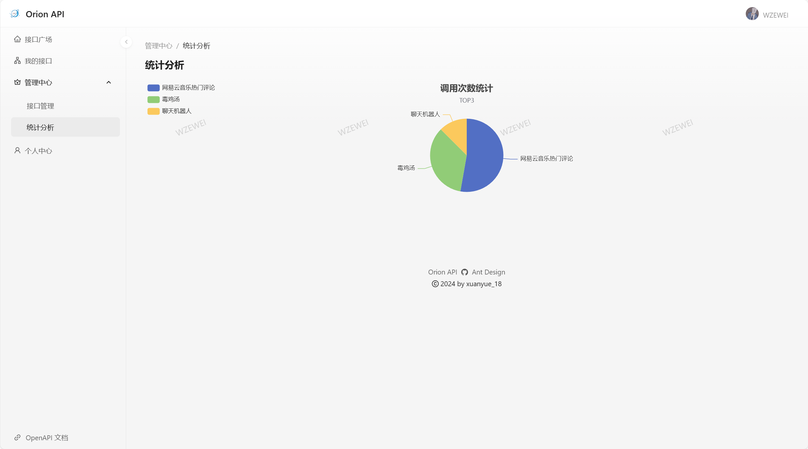
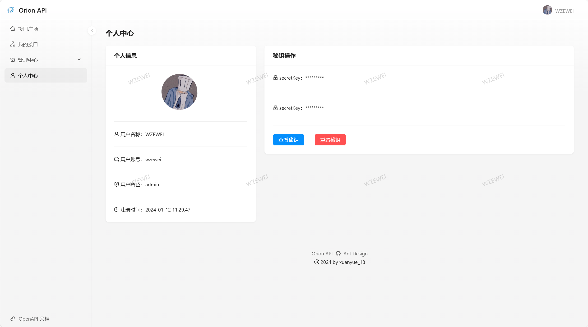

# Orion-API 接口开放平台

## 项目介绍
**Orion-API** 是一个为开发者设计的接口开放平台，允许用户进行注册和登录，以便开通或关闭API接口的调用权限。该平台提供的API接口调用将会被精确统计，以支持后续的收费策略实施。此外，管理员能够发布、下线、接入以及在线调试接口，增强平台的可用性和灵活性。
> 演示地址：[https://openapi.xuanyue18.cn/](https://openapi.xuanyue18.cn/)
## 项目背景
在现代的前端开发中，后端接口的作用至关重要，它们是获取数据的桥梁。尽管市场上存在众多的API接口调用平台，但创建一个自己的平台能更好地满足特定的需求，包括但不限于：
1. 自定义用户权限，使用户能够在前端平台上注册、登录，并开通或关闭接口调用权限。
2. 允许管理员对接口进行全面的管理（增加、删除、修改和查询）。

此外，本平台着重于以下要求：
1. 高安全性，以防止恶意攻击。
2. 严格的调用限制，以保护接口不被滥用。
3. 对API调用次数进行统计，以便于监控和管理。
4. 保护网络流量，避免资源浪费。
5. 简化API的接入和集成过程。

## 技术选型
为了提供一个稳定、高效和易于使用的平台，我们采用了以下技术栈：

### 前端
- **Ant Design Pro**: 一套企业级的UI设计语言和React实现。
- **React**: 用于构建用户界面的JavaScript库。
- **Umi**: 插件化的企业级前端应用框架。
- **Umi Request**: 对Axios的封装，提供了更加便捷的API请求方式。

### 后端
- **Spring Boot**: 便于创建独立的、生产级别的Spring基于的应用程序。
- **Spring Cloud Gateway**: 提供了一种简单有效的方式来路由到API，并为它们提供跨域处理。
- **Dubbo**: 高性能的Java RPC框架。
- **Nacos**: 用于服务发现和配置管理的动态服务发现、配置管理和服务管理平台。
- **Spring Boot Starter**: 提供快速开发新Spring应用的工具集。

通过结合这些技术，Orion-API 接口开放平台旨在为开发者提供一个稳定、高效、安全的API调用服务。

## 业务流程

## 项目演示
### 用户登录

### 接口广场

### 接口调用

### 接口管理

### 接口统计

### 个人中心
